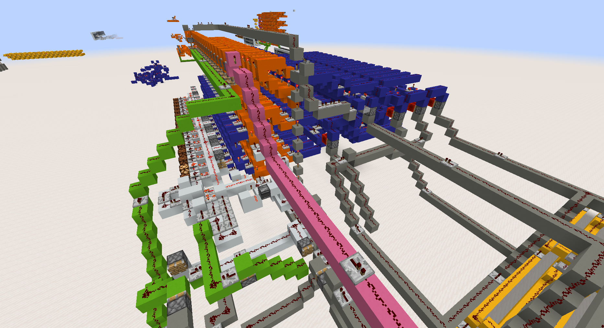

# ALU

The ALU, or Arithmetic and Logic Unit, is the part of the CPU which performs arthmetic and logic operations, such as additions or bitshifting.

It has 3 register (in orange). Two to hold the input values and one for the output.

This exact design comes from a video of [n00b_asaurus](https://www.youtube.com/@n00basaurus) titled ["Compact Redstone ALU + Tutorial"](https://www.youtube.com/watch?v=nPBYOF3bfiA).

