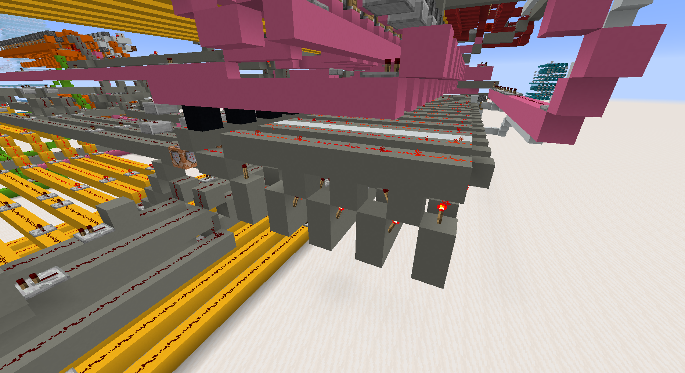
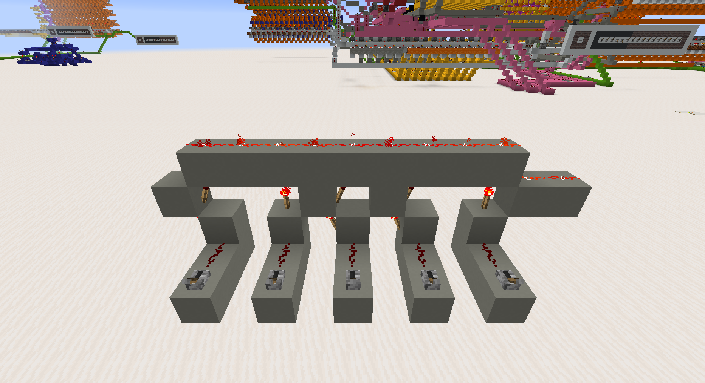
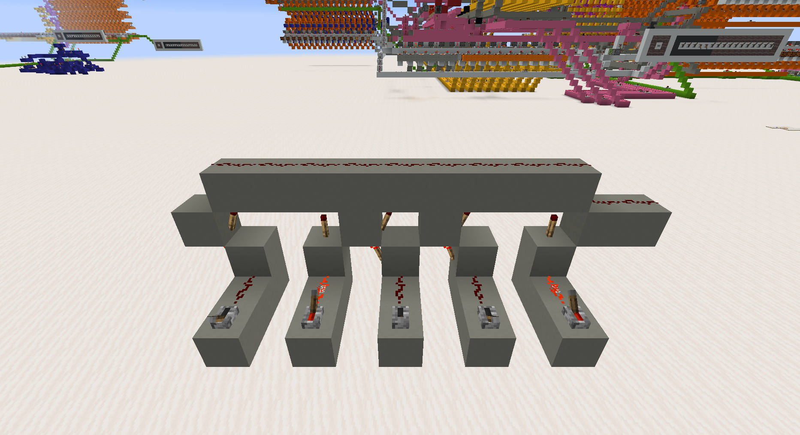
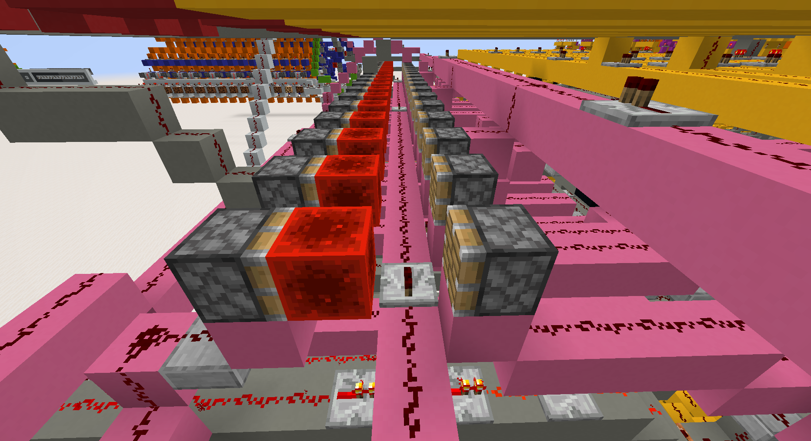
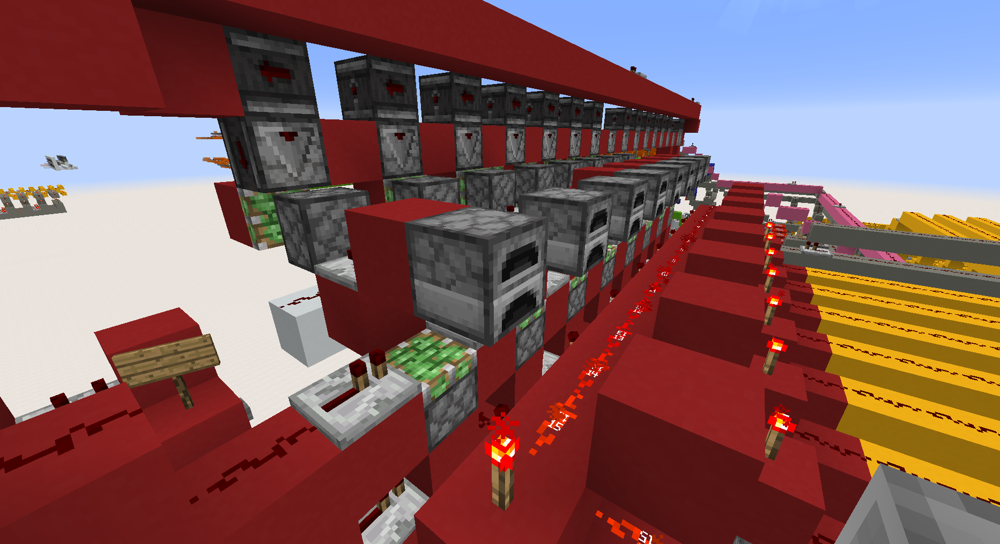

# CPU

The CPU, or Central Processing Unit, receives instructions, interprets them and controls the other components of the computer.

In the screenshot above, the CPU is the grey part. Each "slice" detects one opcode. The redstone torches are a combination of AND and NOT gates which detect particular combinations of bits. For example, the last slice visible here detects the opcode `10001` (the most significant bit is on the right).

Hereunder is a single slice detecting the opcode `01001` (MSB is on the left). The output is reversed, so it should be off when activated, as shown in the second picture.

## State tracker

When an instruction is being executed, a state tracker (pink part) holds the status of every ongoing activities. When everything is finished, it triggers the PC (Program Counter) to send the CPU the next address.

Here is a better view of the State Tracker

## Program Counter

The PC, short for program counter, holds the current address of execution and increments it after each instruction. It can also be set using JUMP. When the state tracker indicates that all ongoing actions have completed, it send a FETCH instruction to the CPU.
