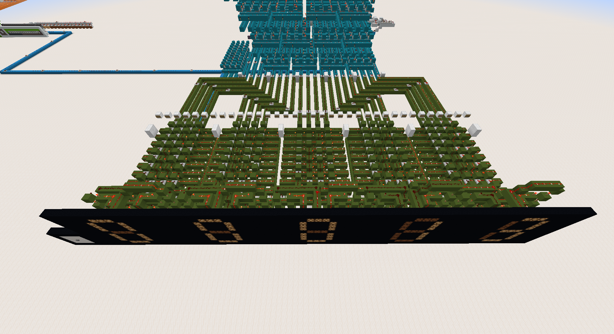

# BCD to 7-Segment Converter

After converting binary to BCD, the data must be mapped to the 7-segment displays. This is done thanks to the dark green circuit, which is essentially a table holding the ouputs corresponding to the possible inputs.

