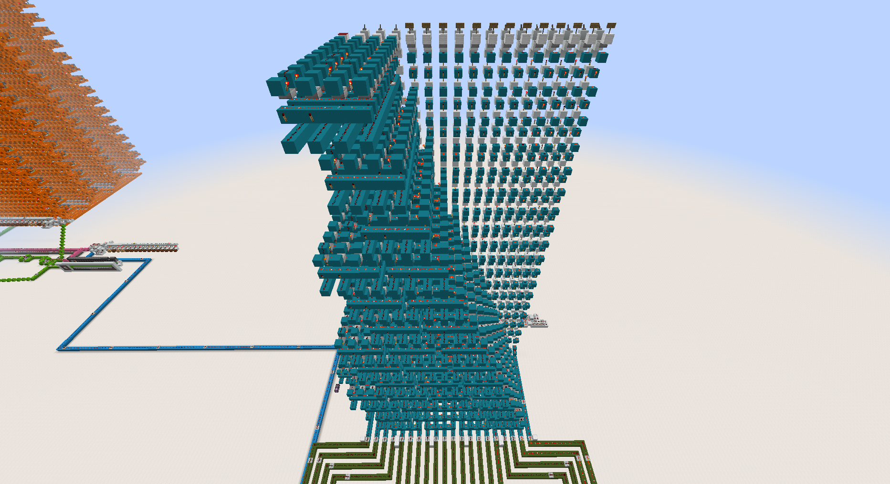
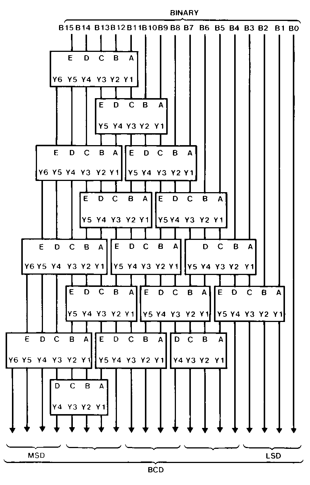

# Binary to BCD Converter

To display the output of the computer on 7-segment displays, the binary data must first be converted to BCD (Binary Coded Decimal). This is done thanks to the giant cyan circuit.

It is composed of several modules which apply the "[Double Dabble](https://en.wikipedia.org/wiki/Double_dabble)" algorithm following this circuit diagram, taken from the [DM74185A datasheet](https://datasheetspdf.com/pdf/516096/NationalSemiconductor/DM74185A/1).

