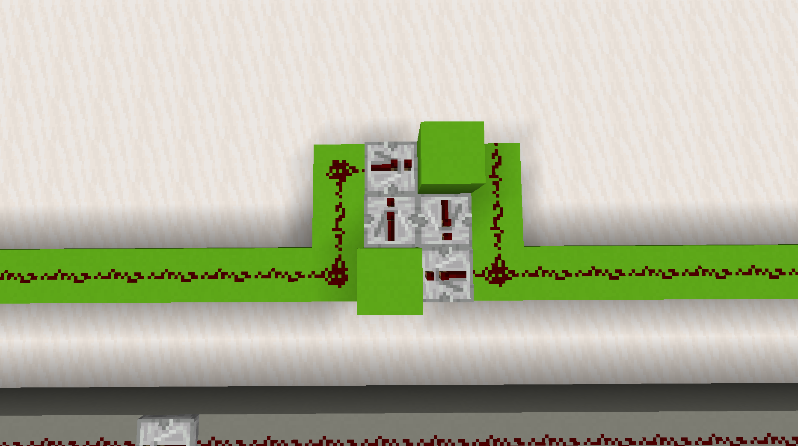

# Data Bus

To transmit data between components, a data bus is used. This green wire connects all inputs and outputs.

To keep the computer reasonably small, it was decided to transmit data serially.

Since Minecraft's redstone has a maximum distance to which it can travel, two way repeaters are place along the bus, as shown in this screenshot

