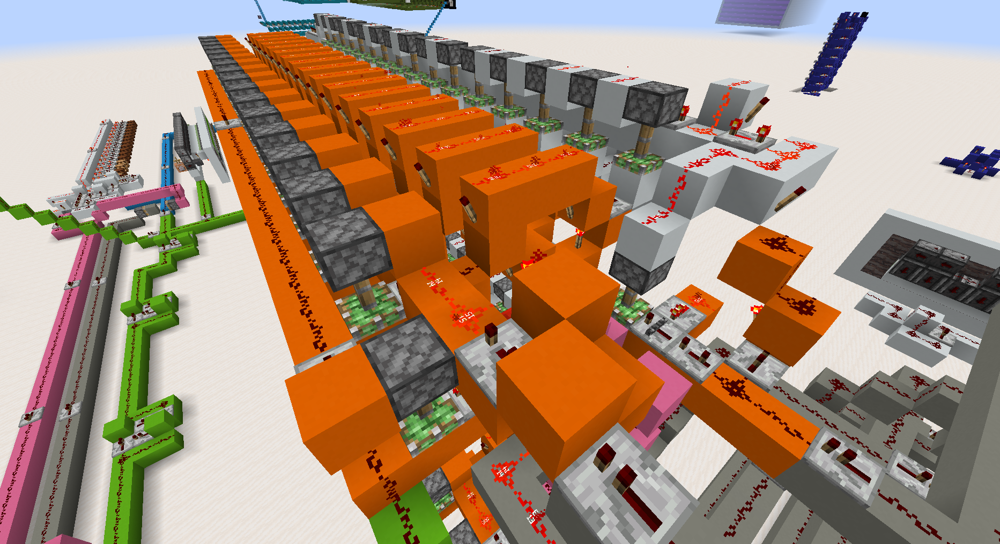
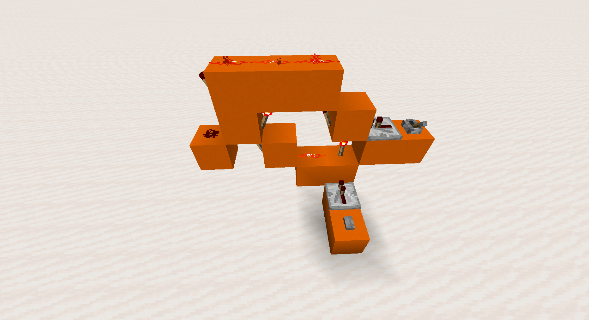
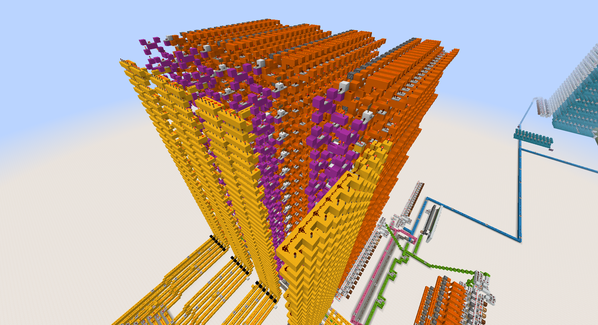

# Registers

To store data in the redstone computer, there are several registers. A register is a group of memory cells each keeping in memory 1 bit of data.

The cells used in this build are made of D latches. This type of circuit has 2 inputs, Set and Data, and 1 output.

When the Set input is activated the value of the Data input is stored in the cell.

The following screenshot shows how the latch is built

Here the lever on the right is the Data input, whereas the button is the Set input. The output is on the left.

## Memory

The main memory storage is simply made of a number of registers. Then the inputs are activated when their respective address is selected.

The memory registers are in orange, the address selector is in yellow and the Set and Get inputs are in magenta.

