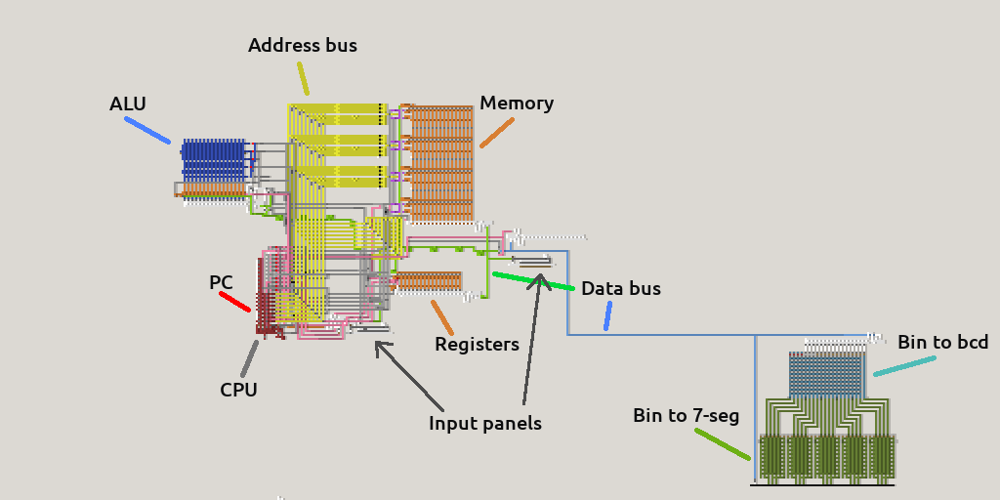

## Components



- [CPU](components/CPU.md): processes instructions and activates the other components
- [PC](components/CPU.md#program-counter): keeps track of the address of the currently executed instruction
- [ALU](components/ALU.md): responsible for actual mathematical computations
- [Registers](components/registers.md): 2 registers used for bi-operands operations
- [Memory](components/registers.md#memory): main memory storage (addressed)
- [Data bus](components/data_bus.md): cable used for data transfer between components
- [Bin to bcd](components/bin_to_bcd.md): a converter from binary to BCD (Binary Coded Decimal)
- [Bin to 7-seg](components/bcd_to_7seg.md): a converter from binary/BCD to 7-segment displays
  
## Characteristics
- **System**: 16-bit
- **Memory**: 64 addresses (128 bytes)
- **Operations**: add, NOT, bitshift, increment, decrement, AND, XOR

## Instruction Set

Instructions are encoded as follows:
```
     MSB                                           LSB
bits:  0  1  2  3  4  5  6  7  8  9 10 11 12 13 14 15
       \______________/  \__________________________/
          operation        direct value or address
```

The instruction set is composed of the following instructions:
<details>
<summary>Reveal</summary>

| Opcode (DEC) | Opcode (BIN) | Name | Description |
|:---:|:---:|:---|:---|
|  0 | 000000 | LOAD R1 | Load the address into register 1 |
|  1 | 000001 | STORE R1 | Store content of register 1 into the address |
|  2 | 000010 | JUMP R1 IF | Jump to address if register 1 is equal to 0 |
|  3 | 000011 | ADD R1 | Add content at address to register 1 |
|  4 | 000100 | << R1 | Bithisft register 1 to left |
|  5 | 000101 | NOT R1 | Bitwise NOT register 1 |
|  6 | 000110 | JUMP | Jump to address |
|  7 | 000111 | STOP | Terminate program |
|  8 | 001000 | LOAD R2 | Load the address into register 2 |
|  9 | 001001 | STORE R2 | Store content of register 2 into the address |
| 10 | 001010 | JUMP R2 IF | Jump to address if register 2 is equal to 0 |
| 11 | 001011 | ADD R2 | Add content at address to register 2 |
| 12 | 001100 | << R2 | Bithisft register 2 to left |
| 13 | 001101 | NOT R2 | Bitwise NOT register 2 |
| 14 | 001110 | OUT R1 | Output register 1 |
| 15 | 001111 | OUT R2 | Output register 2 |
| | | | |
| 16 | 010000 | FETCH | Fetch the next instruction |
| 17 | 010001 | INCR R1 | Increment register 1 |
| 18 | 010010 | DECR R1 | _**(not impl.)**_ Decrement register 1 |
| 19 | 010011 | AND R1 | _**(not impl.)**_ Bitwise AND between content at address and register 1 |
| 20 | 010100 | XOR R1 | _**(not impl.)**_ Bitwise XOR between content at address and register 1 |
| 21 | 010101 | - | - |
| 22 | 010110 | - | - |
| 23 | 010111 | - | - |
| 24 | 011000 | - | - |
| 25 | 011001 | INCR R2 | _**(not impl.)**_ Increment register 2 |
| 26 | 011010 | DECR R2 | _**(not impl.)**_ Decrement register 2 |
| 27 | 011011 | AND R2 | _**(not impl.)**_ Bitwise AND between content at address and register 2 |
| 28 | 011100 | XOR R2 | _**(not impl.)**_ Bitwise XOR between content at address and register 2 |
| 29 | 011101 | - | - |
| 30 | 011110 | - | - |
| 31 | 011111 | - | - |

</details>

## Sample program

The following program computes the terms of the Fibonacci sequence.

| Address (DEC) | Address (BIN) | Data | Meaning |
|:---:|:---:|:---:|:---|
|  0 | 000000 | 000000 0000001101 | Load address 13 into register 1 |
|  1 | 000001 | 000011 0000001111 | Add address 15 to register 1 |
|  2 | 000010 | 001110 0000000000 | Output register 1 |
|  3 | 000011 | 000001 0000001111 | Store register 1 into address 15 |
|  4 | 000100 | 000011 0000001110 | Add address 14 to register 1 |
|  5 | 000101 | 001110 0000000000 | Output register 1 |
|  6 | 000110 | 000001 0000001110 | Store register 1 into address 14 |
|  7 | 000111 | 000110 0000000001 | Jump to address 1 |
| | | | |
| 13 | 001101 | 0000000000000000 | 0 |
| 14 | 001110 | 0000000000000001 | 1 |
| 15 | 001111 | 0000000000000001 | 1 |
